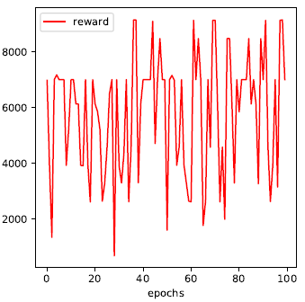
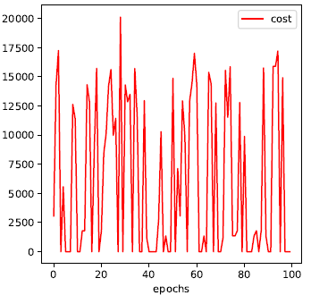
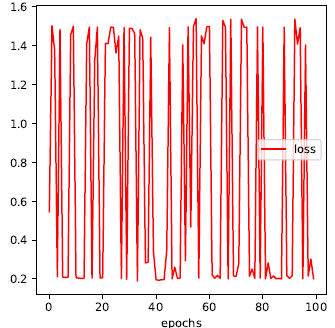
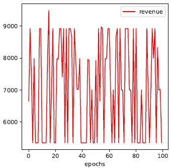
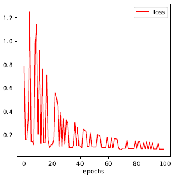
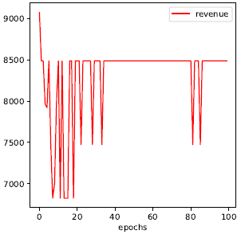

### Installation

Install tensorflow

### About the project

Network virtualization allows the substrate(physical) network to be shared between several virtualized networks. These virtual
 networks are most commonly identified in cloud based services such as the ones provided by the likes of Amazon Web Service, Google Cloud that enable services on a virtual environment. 
 Embedding in virtualized networks determines the efficiency of usage of network resources. Virtual to physical mapping based solutions follow static procedures due to which optimization cannot be achieved.
 To solve this problem, we introduce a Reinforcement Learning (RL) algorithm for coordinated virtual network embeddings. We implement a RL based policy network to make mapping decisions. 
 We train our reinforcement learning agent (RLA) based on the incoming network requests and evaluate its performance accordingly. 
 We use an artificial neural network called policy network as our RLA. This agent maps the node embedding based on the status of the substrate network. The RLA or the policy network is trained with historical network requests using policy gradient. 
 A greedy strategy is used to obtain the complete evaluation of the efficacy of the policy network. The agent performs substantially better when compared to two similar embedding algorithms, which are based on node ranking methods, in terms of revenue, cost function and revenue to cost ratio.
 Simulation results show that the reinforcement learning agent learns from historical data and performs better over time.

### Input files
1. nsf_14_network.json :
    In this file nsf_net network topology was defined.
    you can change it with your network topology.
    
    How?
    
    One dictionary that is defined in this file contains "networkTopology"
    and in the "networkTopology" list, "Nodes" and "Links" are defined.

    In the "Nodes" list, list of all topology nodes and their capacity are defined. 
    The first element is the name of the node and the second element is capacity.
    You can also change the order of them by two parameters 
        network_topology_node_name = 0
            network_topology_node_cap = 1
    in the InputConstants.py file.

    In the "Links" dictionary, all network topology links are defined.
    For example:
         "1":[["2", 2100, 100], ["3", 3000, 100], ["8", 4800, 100]]
    specifies that node "1" is connected to node "2" with link that has length 2100 and 
    capacity 100.
    We can change order of node name, length and capacity with three parameters:
        network_topology_link_name = 0
        network_topology_link_dis = 1
        network_topology_link_cap = 2
    in the InputConstants.py
 2. chains.json
    In this file, chains are defined which contains two "functions" and "chains" 
    dictionary. We can define our chains in this json file.

    How?
    
    In the "functions" dictionary, functions that used in chains were placed. In
    each function defined in a list and first element of the list belongs
    to the function's name and the second element determines the number of CPU
    core that function needs. We can change the order of name and CPU usage
    of functions by two parameters:
      *function_name = 0*
      *function_usage = 1*
    in the InputConstants.py         
3. chain_random.json
    This json file creates automatically with
    **"generate_chains_functions(creat_chains_functions(path, chain_num, fun_num, ban, CPU)"**
    where the path is a path for storing generated file, chain_num is number of chains you 
    want to generate, fun_num is the maximum number of chains' function, the ban is the
    maximum bandwidth of  chains and CPU is the maximum number of cup cores that each
    function needs. 
### Parameters
We can change parameters of simulation (learning rate, number of epoch, ...) in the      	*"InputConstants.py"* which placed in the *"Given"* folder

### Results

We run the learning agent on the training set for 100 epochs and observe its performance.
Multiple trial runs of the algorithm were conducted to assess the performance of the algorithm. 
Initially, most of the test cases would return inconsistent results as shown in Fig. 1-11.
* Reward

 
In Fig 1, the reward function presents unstable results as it is early in the learning stages. 

* Cost

Ideally, we expect cost function to decrease with the number of cycles but as it is early in the learning stages, we observe high values of cost.
                    
* Loss 

Loss factor is expected to decrease as learning progresses but here we see that the loss is not within expected range.
               
* Revenue 

This is the long-term revenue to cost ratio. Like the rest of the factors, we see that the values do not stabilize and vary over a range of values which is not ideal.

After obtaining enough historical data from previous network requests, the results of the proposed scheme improved significantly as shown in the following figures. 
              
#### Improved Results
* Reward: 

The reward initially drops drastically in the first 20 epochs and then increases to the range of 9000 to 11000. 
Stability in variation of the reward is observed after 40 epochs. This is because the algorithm has gone through multiple trial runs. A better utilization of network resources leads to a high long-term average revenue with comparatively low cost of substrate network which gives better reward.

* Cost 

The cost function measures the total amount of bandwidth resources assigned to a virtual request. A significant spike is observed in the initial learning stages of the first 10 epochs after which, the cost gradually reduces to achieve stability.							
   
* Loss 

The loss value for each piece of data during the training sums up to an aggregated loss value, and the aim is to minimize the aggregated loss value. 
We observe a decrease in loss function after 20 epochs to a minimal value which is desirable during a successful embedding process.

* Revenue 

This is the long-term revenue to cost ratio. The revenue factor measures the profit of an internet service provider for accepting a certain virtual re-quest, and it depends on the amount of requested resources and the duration of it. 
In our simulation, the revenue varies between 7000 to 8500 until 40 epochs, after which a stability in variation of revenue is achieved signaling successful embedding process.

### Conclusion

In this research, we have presented a virtual network embedding based on reinforcement learning. The embedding process relies on learning through training from historical data rather than any static rules.
From the simulations, we can see that the learning agent produces considerably better results in terms of cost, revenue and revenue / cost ratio. Also, based on the performance metrics, we observe a decrease in the performance in the initial phases of learning. But after running the algorithm for multiple cycles, the performance on all metrics starts to stabilize as the learning progresses. The result shows that the reinforcement learning based algorithm is getting better performance as the training goes which means the learning agent can adapt itself to historical data.
